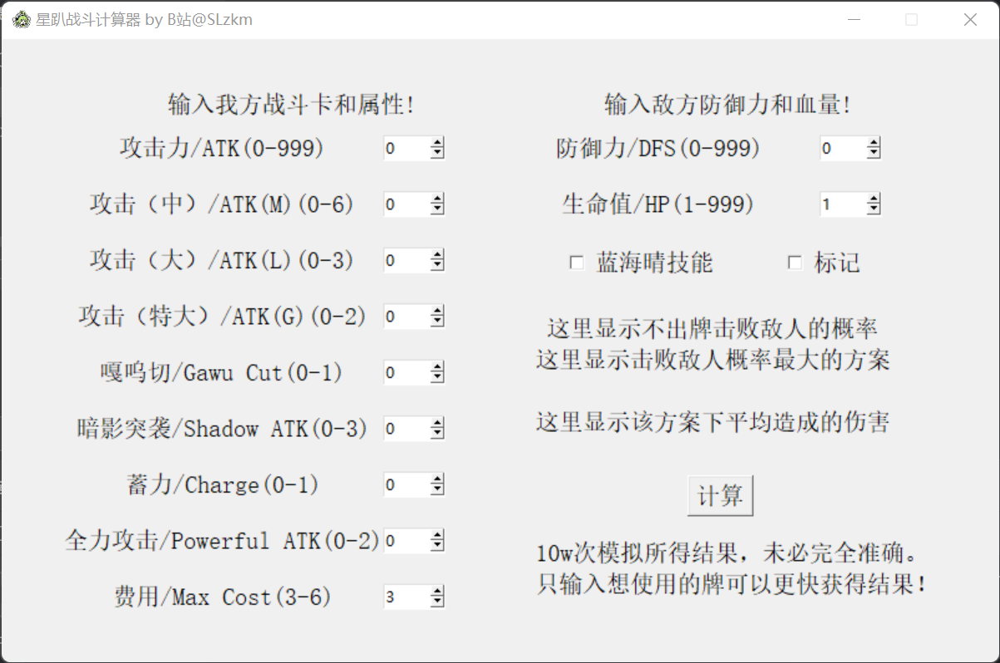

# 星趴战斗计算器/Astral Party Fight Calculator
一个初学者制作的，用于《星引擎Party》战斗过程的数值计算器。

A beginner's made numerical calculator for the Battle Progression of Astral Party.

## 展示页面/Showcase

输入我方攻击力、费用上限和各种卡牌数量，以及敌人防御力与生命值，按下“计算”按钮，自动给出最佳出牌方式，并提供获胜概率和平均伤害。

Enter your Attack Power, Max Cost, and the number of cards you have, as well as the enemy's Defense and Health, and press the "Calculate" button to automatically give you the best way to play your cards, as well as the probability of winning and the average damage.

## 更新计划/Future Updates
- ~~PvE攻击计算器/Attack Calculator in PvE~~

- PvE防御计算器/Defense Calculator in PvE

- PvP战斗计算器/Fight Calculator in PvP
